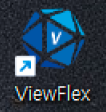
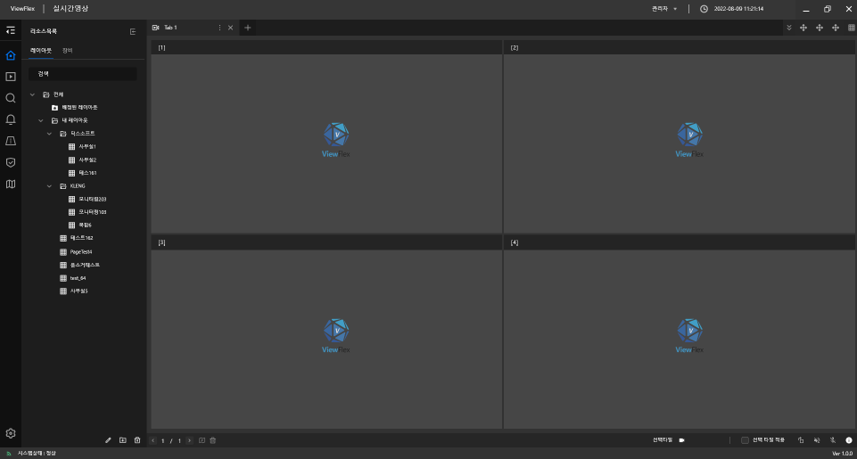
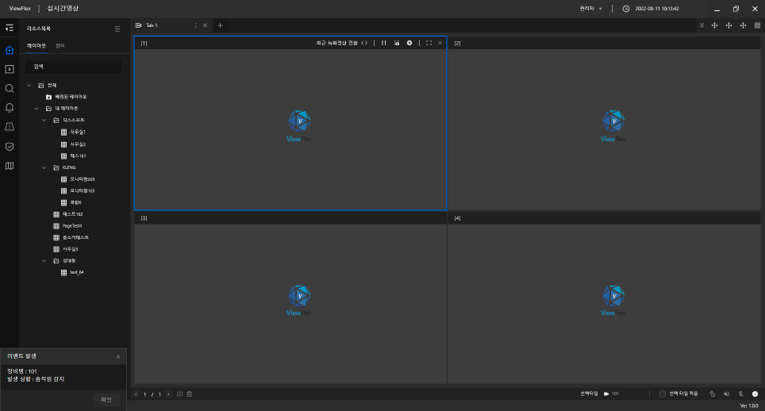

## Video Management System(VMS)
Here is the database design (excluding views) with all foreign keys connected:

## Description

### Installer:  
Create a Installer for VMS. 

### Default Page:  
This is the default page when progrom open. 
At the left side, it contains all the cctv which are connected to the server.  
User can drag & drop or double clicking the cctv icon to watch live stream.  

### Event Alert:  
At the left bottom side, if there are any issues occure, there will be warning alerts. 

