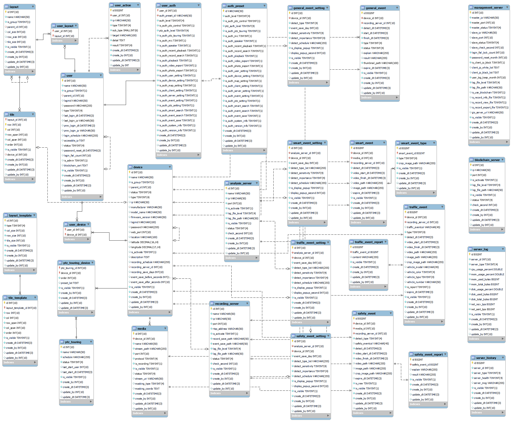

## Video Management System(VMS)
Here is the database design (excluding views) with all foreign keys connected:

## Description

### Installer:  
Create a Installer for VMS. 

### Default Page:  
This is the default page when progrom open. 
At the left side, it contains all the cctv which are connected to the server.  
User can drag & drop or double clicking the layout icon to watch live streams.  

### Event Alert:  
At the left bottom side, if there are any issues occure, there will be warning alerts. 

### Watch CCTV:  
Each cell will contain each CCTV. 
User can custom the layout up to 8X8(total 64 CCTV) in one layout. 
Also, user can have multiple tabs in Streaming section. 

### Checking the location:  
User can check the location of all cctv. 
By using Kakao GIS API, it is more easy to find out where the cctv is. 
User can zoom in & out, move up & down & right & left the map. 

### PopUp location:  
It is possible to make PopUp window for live map. 

### Live CCTV on Map:  
Whenever the user hover the mouse on the CCTV icon, the program will show the live. 

