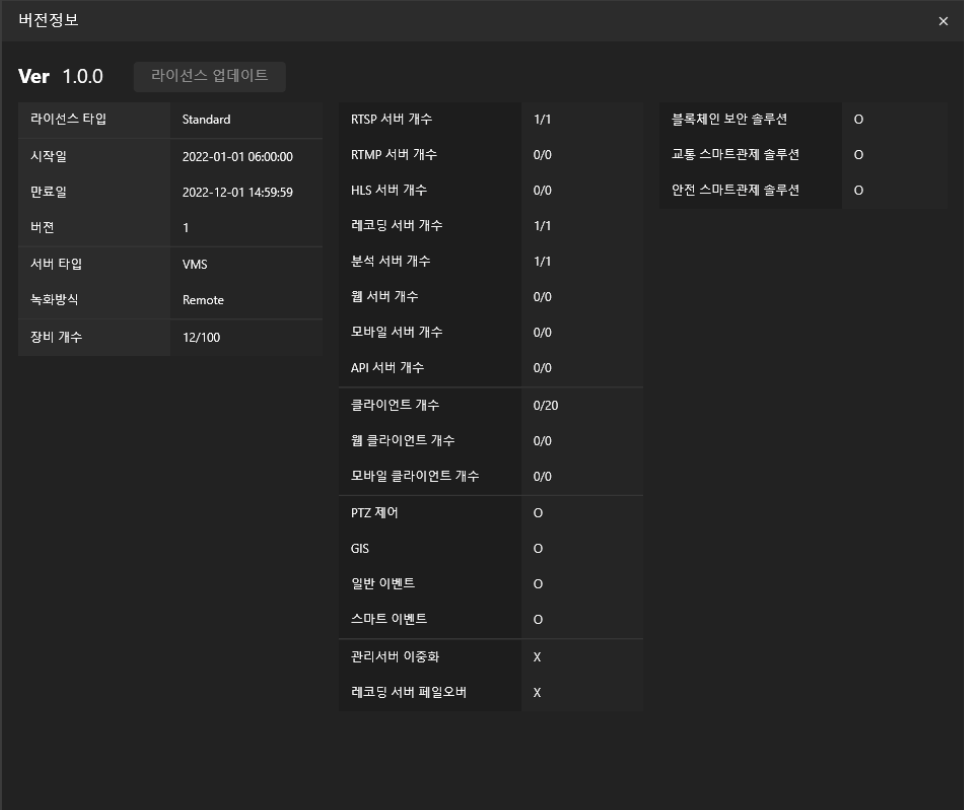

## Video Management System(VMS)
Here is the database design (excluding views) with all foreign keys connected:

## Description

### Installer:  
Create a Installer for VMS. 

## Major Tabs
There are total 7 tabs and each tab has different role  
1. Home = User can watch streaming  
2. Record = User can watch recorded video  
3. SmartSearch = User can search specific objects(i.e red backpack, blue SUV, truck etc.) for any reason  
4. Event = User can search irreular event (i.e covering CCTV from unknown, unplanned CCTV movement etc.)  
5. SmartTraffic = Users can grasp the current traffic situation at a glance  
6. SmartSafety = Users can access the video which CCTV automatically storing incident video using artificial intelligence technology  
7. LiveMap = A user can grasp the location and information of CCTV through a real-time map using GIS  

### Default Page:  
This is the default page when progrom open. 
At the left side, it contains all the cctv which are connected to the server.  
User can drag & drop or double clicking the layout icon to watch live streams.  

### Event Alert:  
At the left bottom side, if there are any issues occure, there will be warning alerts. 

### Watch CCTV:  
Each cell will contain each CCTV. 
User can custom the layout up to 8X8(total 64 CCTV) in one layout. 
Also, user can have multiple tabs in Streaming section. 

### Controll PTZ CCTV:  
If the selected CCTV's type is PTZ camera, User can zoom & move the direction of cctv by using PTZ Controller 
User can also use stored directions. 

### Checking The Location:  
User can check the location of all cctv. 
By using Kakao GIS API, it is more easy to find out where the cctv is. 
User can zoom in & out, move up & down & right & left the map. 

### PopUp Location:  
It is possible to make PopUp window for live map. 

### Live CCTV On Map:  
Whenever the user hover the mouse on the CCTV icon, the program will show the live. 

### All CCTVs In One Map:  
In LiveMap session, user can find all the CCTVs just in one map. 

### All Informations about the program:  
User can access the information about 'Log History' 'System Monitoring' 'Version Status'. 

